# Face Generation
In this project, you'll use generative adversarial networks to generate new images of faces.
### Get the Data
You'll be using two datasets in this project:
- MNIST
- CelebA

Since the celebA dataset is complex and you're doing GANs in a project for the first time, we want you to test your neural network on MNIST before CelebA.  Running the GANs on MNIST will allow you to see how well your model trains sooner.

If you're using [FloydHub](https://www.floydhub.com/), set `data_dir` to "/input" and use the [FloydHub data ID](http://docs.floydhub.com/home/using_datasets/) "R5KrjnANiKVhLWAkpXhNBe".


```python
# data_dir = './data'

# FloydHub - Use with data ID "R5KrjnANiKVhLWAkpXhNBe"
data_dir = '/input'


"""
DON'T MODIFY ANYTHING IN THIS CELL
"""
import helper

helper.download_extract('mnist', data_dir)
helper.download_extract('celeba', data_dir)
```

    Found mnist Data
    Found celeba Data


## Explore the Data
### MNIST
As you're aware, the [MNIST](http://yann.lecun.com/exdb/mnist/) dataset contains images of handwritten digits. You can view the first number of examples by changing `show_n_images`.


```python
show_n_images = 25

"""
DON'T MODIFY ANYTHING IN THIS CELL
"""
%matplotlib inline
import os
from glob import glob
from matplotlib import pyplot

mnist_images = helper.get_batch(glob(os.path.join(data_dir, 'mnist/*.jpg'))[:show_n_images], 28, 28, 'L')
pyplot.imshow(helper.images_square_grid(mnist_images, 'L'), cmap='gray')
```


    <matplotlib.image.AxesImage at 0x7f65e03ea0f0>


### CelebA
The [CelebFaces Attributes Dataset (CelebA)](http://mmlab.ie.cuhk.edu.hk/projects/CelebA.html) dataset contains over 200,000 celebrity images with annotations.  Since you're going to be generating faces, you won't need the annotations.  You can view the first number of examples by changing `show_n_images`.


```python
show_n_images = 25

"""
DON'T MODIFY ANYTHING IN THIS CELL
"""
mnist_images = helper.get_batch(glob(os.path.join(data_dir, 'img_align_celeba/*.jpg'))[:show_n_images], 28, 28, 'RGB')
pyplot.imshow(helper.images_square_grid(mnist_images, 'RGB'))
```


    <matplotlib.image.AxesImage at 0x7f65e02e8160>


## Preprocess the Data
Since the project's main focus is on building the GANs, we'll preprocess the data for you.  The values of the MNIST and CelebA dataset will be in the range of -0.5 to 0.5 of 28x28 dimensional images.  The CelebA images will be cropped to remove parts of the image that don't include a face, then resized down to 28x28.

The MNIST images are black and white images with a single [color channel](https://en.wikipedia.org/wiki/Channel_(digital_image%29) while the CelebA images have [3 color channels (RGB color channel)](https://en.wikipedia.org/wiki/Channel_(digital_image%29#RGB_Images).
## Build the Neural Network
You'll build the components necessary to build a GANs by implementing the following functions below:
- `model_inputs`
- `discriminator`
- `generator`
- `model_loss`
- `model_opt`
- `train`

### Check the Version of TensorFlow and Access to GPU
This will check to make sure you have the correct version of TensorFlow and access to a GPU


```python
"""
DON'T MODIFY ANYTHING IN THIS CELL
"""
from distutils.version import LooseVersion
import warnings
import tensorflow as tf

# Check TensorFlow Version
assert LooseVersion(tf.__version__) >= LooseVersion('1.0'), 'Please use TensorFlow version 1.0 or newer.  You are using {}'.format(tf.__version__)
print('TensorFlow Version: {}'.format(tf.__version__))

# Check for a GPU
if not tf.test.gpu_device_name():
    warnings.warn('No GPU found. Please use a GPU to train your neural network.')
else:
    print('Default GPU Device: {}'.format(tf.test.gpu_device_name()))
```

    TensorFlow Version: 1.1.0
    Default GPU Device: /gpu:0


### Input
Implement the `model_inputs` function to create TF Placeholders for the Neural Network. It should create the following placeholders:
- Real input images placeholder with rank 4 using `image_width`, `image_height`, and `image_channels`.
- Z input placeholder with rank 2 using `z_dim`.
- Learning rate placeholder with rank 0.

Return the placeholders in the following the tuple (tensor of real input images, tensor of z data)


```python
import problem_unittests as tests

def model_inputs(image_width, image_height, image_channels, z_dim):
    """
    Create the model inputs
    :param image_width: The input image width
    :param image_height: The input image height
    :param image_channels: The number of image channels
    :param z_dim: The dimension of Z
    :return: Tuple of (tensor of real input images, tensor of z data, learning rate)
    """
    # TODO: Implement Function
    real_input_images = tf.placeholder(tf.float32, [None, image_width, image_height, image_channels], 'real_input_images')
    input_z = tf.placeholder(tf.float32, [None, z_dim], 'input_z')
    learning_rate = tf.placeholder(tf.float32, [], 'learning_rate')
    return real_input_images, input_z, learning_rate


"""
DON'T MODIFY ANYTHING IN THIS CELL THAT IS BELOW THIS LINE
"""
tests.test_model_inputs(model_inputs)
```

    Tests Passed


### Discriminator
Implement `discriminator` to create a discriminator neural network that discriminates on `images`.  This function should be able to reuse the variables in the neural network.  Use [`tf.variable_scope`](https://www.tensorflow.org/api_docs/python/tf/variable_scope) with a scope name of "discriminator" to allow the variables to be reused.  The function should return a tuple of (tensor output of the discriminator, tensor logits of the discriminator).


```python
def discriminator(images, reuse=False, alpha=0.2, keep_prob=0.5):
    """
    Create the discriminator network
    :param images: Tensor of input image(s)
    :param reuse: Boolean if the weights should be reused
    :return: Tuple of (tensor output of the discriminator, tensor logits of the discriminator)
    """
    # TODO: Implement Function
    with tf.variable_scope('discriminator', reuse=reuse):
        # Input layer is 28x28xn
        # Convolutional layer, 14x14x64
        conv1 = tf.layers.conv2d(images, 64, 5, 2, padding='same', kernel_initializer=tf.contrib.layers.xavier_initializer())
        lrelu1 = tf.maximum(alpha * conv1, conv1)
        drop1 = tf.layers.dropout(lrelu1, keep_prob)

        # Strided convolutional layer, 7x7x128
        conv2 = tf.layers.conv2d(drop1, 128, 5, 2, 'same', use_bias=False)
        bn2 = tf.layers.batch_normalization(conv2)
        lrelu2 = tf.maximum(alpha * bn2, bn2)
        drop2 = tf.layers.dropout(lrelu2, keep_prob)

        # Strided convolutional layer, 4x4x256
        conv3 = tf.layers.conv2d(drop2, 256, 5, 2, 'same', use_bias=False)
        bn3 = tf.layers.batch_normalization(conv3)
        lrelu3 = tf.maximum(alpha * bn3, bn3)
        drop3 = tf.layers.dropout(lrelu3, keep_prob)

        # fully connected
        flat = tf.reshape(drop3, (-1, 4*4*256))
        logits = tf.layers.dense(flat, 1)
        out = tf.sigmoid(logits)

        return out, logits


"""
DON'T MODIFY ANYTHING IN THIS CELL THAT IS BELOW THIS LINE
"""
tests.test_discriminator(discriminator, tf)
```

    Tests Passed


### Generator
Implement `generator` to generate an image using `z`. This function should be able to reuse the variables in the neural network.  Use [`tf.variable_scope`](https://www.tensorflow.org/api_docs/python/tf/variable_scope) with a scope name of "generator" to allow the variables to be reused. The function should return the generated 28 x 28 x `out_channel_dim` images.


```python
def generator(z, out_channel_dim, is_train=True, alpha=0.2, keep_prob=0.5):
    """
    Create the generator network
    :param z: Input z
    :param out_channel_dim: The number of channels in the output image
    :param is_train: Boolean if generator is being used for training
    :return: The tensor output of the generator
    """
    # TODO: Implement Function
    with tf.variable_scope('generator', reuse=(not is_train)):
        # First fully connected layer, 4x4x1024
        fc = tf.layers.dense(z, 4*4*1024, use_bias=False)
        fc = tf.reshape(fc, (-1, 4, 4, 1024))
        bn0 = tf.layers.batch_normalization(fc, training=is_train)
        lrelu0 = tf.maximum(alpha * bn0, bn0)
        drop0 = tf.layers.dropout(lrelu0, keep_prob, training=is_train)

        # Deconvolution, 7x7x512
        conv1 = tf.layers.conv2d_transpose(drop0, 512, 4, 1, 'valid', use_bias=False)
        bn1 = tf.layers.batch_normalization(conv1, training=is_train)
        lrelu1 = tf.maximum(alpha * bn1, bn1)
        drop1 = tf.layers.dropout(lrelu1, keep_prob, training=is_train)

        # Deconvolution, 14x14x256
        conv2 = tf.layers.conv2d_transpose(drop1, 256, 5, 2, 'same', use_bias=False)
        bn2 = tf.layers.batch_normalization(conv2, training=is_train)
        lrelu2 = tf.maximum(alpha * bn2, bn2)
        drop2 = tf.layers.dropout(lrelu2, keep_prob, training=is_train)

        # Output layer, 28x28xn
        logits = tf.layers.conv2d_transpose(drop2, out_channel_dim, 5, 2, 'same')

        out = tf.tanh(logits)

        return out


"""
DON'T MODIFY ANYTHING IN THIS CELL THAT IS BELOW THIS LINE
"""
tests.test_generator(generator, tf)
```

    Tests Passed


### Loss
Implement `model_loss` to build the GANs for training and calculate the loss.  The function should return a tuple of (discriminator loss, generator loss).  Use the following functions you implemented:
- `discriminator(images, reuse=False)`
- `generator(z, out_channel_dim, is_train=True)`


```python
def model_loss(input_real, input_z, out_channel_dim, alpha=0.2, smooth_factor=0.1):
    """
    Get the loss for the discriminator and generator
    :param input_real: Images from the real dataset
    :param input_z: Z input
    :param out_channel_dim: The number of channels in the output image
    :return: A tuple of (discriminator loss, generator loss)
    """
    # TODO: Implement Function
    d_model_real, d_logits_real = discriminator(input_real, alpha=alpha)

    d_loss_real = tf.reduce_mean(
        tf.nn.sigmoid_cross_entropy_with_logits(logits=d_logits_real,
                                                labels=tf.ones_like(d_model_real) * (1 - smooth_factor)))

    input_fake = generator(input_z, out_channel_dim, alpha=alpha)
    d_model_fake, d_logits_fake = discriminator(input_fake, reuse=True, alpha=alpha)

    d_loss_fake = tf.reduce_mean(
        tf.nn.sigmoid_cross_entropy_with_logits(logits=d_logits_fake, labels=tf.zeros_like(d_model_fake)))

    g_loss = tf.reduce_mean(
        tf.nn.sigmoid_cross_entropy_with_logits(logits=d_logits_fake, labels=tf.ones_like(d_model_fake)))

    return d_loss_real + d_loss_fake, g_loss


"""
DON'T MODIFY ANYTHING IN THIS CELL THAT IS BELOW THIS LINE
"""
tests.test_model_loss(model_loss)
```

    Tests Passed


### Optimization
Implement `model_opt` to create the optimization operations for the GANs. Use [`tf.trainable_variables`](https://www.tensorflow.org/api_docs/python/tf/trainable_variables) to get all the trainable variables.  Filter the variables with names that are in the discriminator and generator scope names.  The function should return a tuple of (discriminator training operation, generator training operation).


```python
def model_opt(d_loss, g_loss, learning_rate, beta1):
    """
    Get optimization operations
    :param d_loss: Discriminator loss Tensor
    :param g_loss: Generator loss Tensor
    :param learning_rate: Learning Rate Placeholder
    :param beta1: The exponential decay rate for the 1st moment in the optimizer
    :return: A tuple of (discriminator training operation, generator training operation)
    """
    # TODO: Implement Function
    # Get weights and bias to update
    t_vars = tf.trainable_variables()
    d_vars = [var for var in t_vars if var.name.startswith('discriminator')]
    g_vars = [var for var in t_vars if var.name.startswith('generator')]

    # Optimize
    with tf.control_dependencies(tf.get_collection(tf.GraphKeys.UPDATE_OPS)):
        d_train_opt = tf.train.AdamOptimizer(learning_rate, beta1=beta1).minimize(d_loss, var_list=d_vars)
        g_train_opt = tf.train.AdamOptimizer(learning_rate, beta1=beta1).minimize(g_loss, var_list=g_vars)

    return d_train_opt, g_train_opt


"""
DON'T MODIFY ANYTHING IN THIS CELL THAT IS BELOW THIS LINE
"""
tests.test_model_opt(model_opt, tf)
```

    Tests Passed


## Neural Network Training
### Show Output
Use this function to show the current output of the generator during training. It will help you determine how well the GANs is training.


```python
"""
DON'T MODIFY ANYTHING IN THIS CELL
"""
import numpy as np

def show_generator_output(sess, n_images, input_z, out_channel_dim, image_mode):
    """
    Show example output for the generator
    :param sess: TensorFlow session
    :param n_images: Number of Images to display
    :param input_z: Input Z Tensor
    :param out_channel_dim: The number of channels in the output image
    :param image_mode: The mode to use for images ("RGB" or "L")
    """
    cmap = None if image_mode == 'RGB' else 'gray'
    z_dim = input_z.get_shape().as_list()[-1]
    example_z = np.random.uniform(-1, 1, size=[n_images, z_dim])

    samples = sess.run(
        generator(input_z, out_channel_dim, False),
        feed_dict={input_z: example_z})

    images_grid = helper.images_square_grid(samples, image_mode)
    pyplot.imshow(images_grid, cmap=cmap)
    pyplot.show()
```

### Train
Implement `train` to build and train the GANs.  Use the following functions you implemented:
- `model_inputs(image_width, image_height, image_channels, z_dim)`
- `model_loss(input_real, input_z, out_channel_dim)`
- `model_opt(d_loss, g_loss, learning_rate, beta1)`

Use the `show_generator_output` to show `generator` output while you train. Running `show_generator_output` for every batch will drastically increase training time and increase the size of the notebook.  It's recommended to print the `generator` output every 100 batches.


```python
def train(epoch_count, batch_size, z_dim, learning_rate, beta1, get_batches, data_shape, data_image_mode,
          print_every=10, show_every=100):
    """
    Train the GAN
    :param epoch_count: Number of epochs
    :param batch_size: Batch Size
    :param z_dim: Z dimension
    :param learning_rate: Learning Rate
    :param beta1: The exponential decay rate for the 1st moment in the optimizer
    :param get_batches: Function to get batches
    :param data_shape: Shape of the data
    :param data_image_mode: The image mode to use for images ("RGB" or "L")
    """
    # TODO: Build Model
    input_real, input_z, _ = model_inputs(data_shape[1], data_shape[2], data_shape[3], z_dim)
    d_loss, g_loss = model_loss(input_real, input_z, data_shape[3], alpha=0.2)
    d_train_opt, g_train_opt = model_opt(d_loss, g_loss, learning_rate, beta1)

    steps = 0

    with tf.Session() as sess:
        sess.run(tf.global_variables_initializer())
        for epoch_i in range(epoch_count):
            for batch_images in get_batches(batch_size):
                # TODO: Train Model
                steps += 1
                batch_images *= 2.0

                # Sample random noise for G
                batch_z = np.random.uniform(-1, 1, size=(batch_size, z_dim))

                # Run optimizers
                sess.run(d_train_opt, feed_dict={input_real: batch_images, input_z: batch_z})
                sess.run(g_train_opt, feed_dict={input_z: batch_z})

                if steps % print_every == 0:
                    # At the end of each epoch, get the losses and print them out
                    train_loss_d = d_loss.eval({input_real: batch_images, input_z: batch_z})
                    train_loss_g = g_loss.eval({input_z: batch_z})
                    print("Epoch {}/{} Step {}...".format(epoch_i+1, epoch_count, steps),
                      "Discriminator Loss: {:.4f}...".format(train_loss_d),
                      "Generator Loss: {:.4f}".format(train_loss_g))

                if steps % show_every == 0:
                    # Show example output for the generator
                    show_generator_output(sess, 25, input_z, data_shape[3], data_image_mode)
```

### MNIST
Test your GANs architecture on MNIST.  After 2 epochs, the GANs should be able to generate images that look like handwritten digits.  Make sure the loss of the generator is lower than the loss of the discriminator or close to 0.


```python
batch_size = 64
z_dim = 100
learning_rate = 0.00025
beta1 = 0.45


"""
DON'T MODIFY ANYTHING IN THIS CELL THAT IS BELOW THIS LINE
"""
epochs = 2

mnist_dataset = helper.Dataset('mnist', glob(os.path.join(data_dir, 'mnist/*.jpg')))
with tf.Graph().as_default():
    train(epochs, batch_size, z_dim, learning_rate, beta1, mnist_dataset.get_batches,
          mnist_dataset.shape, mnist_dataset.image_mode)
```

    Epoch 1/2 Step 10... Discriminator Loss: 1.0692... Generator Loss: 0.9518
    Epoch 1/2 Step 20... Discriminator Loss: 0.4560... Generator Loss: 2.3037
    Epoch 1/2 Step 30... Discriminator Loss: 0.8797... Generator Loss: 1.2622
    Epoch 1/2 Step 40... Discriminator Loss: 1.0906... Generator Loss: 0.8460
    Epoch 1/2 Step 50... Discriminator Loss: 1.3621... Generator Loss: 0.8222
    Epoch 1/2 Step 60... Discriminator Loss: 2.1478... Generator Loss: 0.2695
    Epoch 1/2 Step 70... Discriminator Loss: 1.1655... Generator Loss: 0.7466
    Epoch 1/2 Step 80... Discriminator Loss: 1.1995... Generator Loss: 0.8961
    Epoch 1/2 Step 90... Discriminator Loss: 1.1959... Generator Loss: 0.7957
    Epoch 1/2 Step 100... Discriminator Loss: 0.8978... Generator Loss: 1.2825


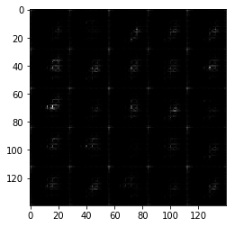


    Epoch 1/2 Step 110... Discriminator Loss: 1.1128... Generator Loss: 1.0476
    Epoch 1/2 Step 120... Discriminator Loss: 1.3927... Generator Loss: 0.6867
    Epoch 1/2 Step 130... Discriminator Loss: 1.0842... Generator Loss: 0.8548
    Epoch 1/2 Step 140... Discriminator Loss: 1.2173... Generator Loss: 0.6735
    Epoch 1/2 Step 150... Discriminator Loss: 0.8578... Generator Loss: 1.3847
    Epoch 1/2 Step 160... Discriminator Loss: 1.4044... Generator Loss: 1.0335
    Epoch 1/2 Step 170... Discriminator Loss: 1.4027... Generator Loss: 0.8056
    Epoch 1/2 Step 180... Discriminator Loss: 1.3705... Generator Loss: 0.8267
    Epoch 1/2 Step 190... Discriminator Loss: 1.4661... Generator Loss: 0.6943
    Epoch 1/2 Step 200... Discriminator Loss: 1.1935... Generator Loss: 0.9517


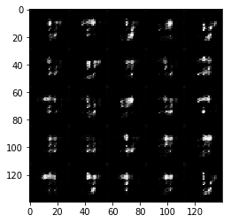


    Epoch 1/2 Step 210... Discriminator Loss: 1.1074... Generator Loss: 1.2539
    Epoch 1/2 Step 220... Discriminator Loss: 1.3589... Generator Loss: 0.8296
    Epoch 1/2 Step 230... Discriminator Loss: 1.2168... Generator Loss: 0.9341
    Epoch 1/2 Step 240... Discriminator Loss: 1.3939... Generator Loss: 0.7380
    Epoch 1/2 Step 250... Discriminator Loss: 1.3202... Generator Loss: 0.8464
    Epoch 1/2 Step 260... Discriminator Loss: 1.4162... Generator Loss: 0.5574
    Epoch 1/2 Step 270... Discriminator Loss: 1.2600... Generator Loss: 0.9346
    Epoch 1/2 Step 280... Discriminator Loss: 1.4571... Generator Loss: 0.5365
    Epoch 1/2 Step 290... Discriminator Loss: 0.8573... Generator Loss: 1.4138
    Epoch 1/2 Step 300... Discriminator Loss: 1.4355... Generator Loss: 1.0636


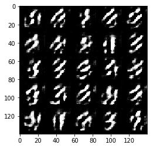


    Epoch 1/2 Step 310... Discriminator Loss: 0.7989... Generator Loss: 1.6676
    Epoch 1/2 Step 320... Discriminator Loss: 1.1260... Generator Loss: 0.8909
    Epoch 1/2 Step 330... Discriminator Loss: 1.4093... Generator Loss: 0.8101
    Epoch 1/2 Step 340... Discriminator Loss: 1.3948... Generator Loss: 0.8094
    Epoch 1/2 Step 350... Discriminator Loss: 1.1244... Generator Loss: 0.9847
    Epoch 1/2 Step 360... Discriminator Loss: 1.2015... Generator Loss: 1.0004
    Epoch 1/2 Step 370... Discriminator Loss: 1.3702... Generator Loss: 0.7965
    Epoch 1/2 Step 380... Discriminator Loss: 1.2748... Generator Loss: 0.9208
    Epoch 1/2 Step 390... Discriminator Loss: 1.2365... Generator Loss: 0.8484
    Epoch 1/2 Step 400... Discriminator Loss: 1.2866... Generator Loss: 0.6381


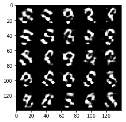


    Epoch 1/2 Step 410... Discriminator Loss: 1.1508... Generator Loss: 0.9408
    Epoch 1/2 Step 420... Discriminator Loss: 1.0345... Generator Loss: 1.0844
    Epoch 1/2 Step 430... Discriminator Loss: 1.2665... Generator Loss: 0.9880
    Epoch 1/2 Step 440... Discriminator Loss: 1.2518... Generator Loss: 0.9178
    Epoch 1/2 Step 450... Discriminator Loss: 1.1810... Generator Loss: 0.9675
    Epoch 1/2 Step 460... Discriminator Loss: 1.2829... Generator Loss: 1.5068
    Epoch 1/2 Step 470... Discriminator Loss: 1.1716... Generator Loss: 0.9918
    Epoch 1/2 Step 480... Discriminator Loss: 1.2355... Generator Loss: 0.8948
    Epoch 1/2 Step 490... Discriminator Loss: 1.2192... Generator Loss: 1.1129
    Epoch 1/2 Step 500... Discriminator Loss: 1.2382... Generator Loss: 1.1834


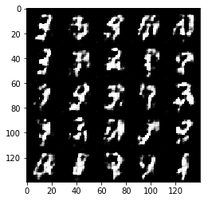


    Epoch 1/2 Step 510... Discriminator Loss: 1.1571... Generator Loss: 1.2391
    Epoch 1/2 Step 520... Discriminator Loss: 1.0599... Generator Loss: 1.2480
    Epoch 1/2 Step 530... Discriminator Loss: 1.4734... Generator Loss: 0.8075
    Epoch 1/2 Step 540... Discriminator Loss: 1.0129... Generator Loss: 1.2614
    Epoch 1/2 Step 550... Discriminator Loss: 1.2633... Generator Loss: 0.9101
    Epoch 1/2 Step 560... Discriminator Loss: 1.2939... Generator Loss: 0.9201
    Epoch 1/2 Step 570... Discriminator Loss: 1.0585... Generator Loss: 1.2190
    Epoch 1/2 Step 580... Discriminator Loss: 1.0944... Generator Loss: 1.0626
    Epoch 1/2 Step 590... Discriminator Loss: 1.3469... Generator Loss: 0.8214
    Epoch 1/2 Step 600... Discriminator Loss: 1.1647... Generator Loss: 1.5231


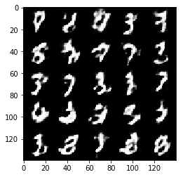


    Epoch 1/2 Step 610... Discriminator Loss: 1.1327... Generator Loss: 1.2595
    Epoch 1/2 Step 620... Discriminator Loss: 1.1282... Generator Loss: 0.8824
    Epoch 1/2 Step 630... Discriminator Loss: 1.2621... Generator Loss: 0.8671
    Epoch 1/2 Step 640... Discriminator Loss: 1.2274... Generator Loss: 0.8477
    Epoch 1/2 Step 650... Discriminator Loss: 1.1407... Generator Loss: 1.4041
    Epoch 1/2 Step 660... Discriminator Loss: 1.0736... Generator Loss: 1.0663
    Epoch 1/2 Step 670... Discriminator Loss: 1.2301... Generator Loss: 0.8768
    Epoch 1/2 Step 680... Discriminator Loss: 1.2288... Generator Loss: 0.9352
    Epoch 1/2 Step 690... Discriminator Loss: 1.2263... Generator Loss: 0.7350
    Epoch 1/2 Step 700... Discriminator Loss: 1.2576... Generator Loss: 0.9314


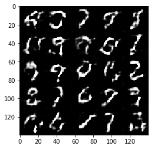


    Epoch 1/2 Step 710... Discriminator Loss: 1.3418... Generator Loss: 0.9051
    Epoch 1/2 Step 720... Discriminator Loss: 1.1827... Generator Loss: 1.3895
    Epoch 1/2 Step 730... Discriminator Loss: 1.0880... Generator Loss: 0.9763
    Epoch 1/2 Step 740... Discriminator Loss: 1.3337... Generator Loss: 0.7958
    Epoch 1/2 Step 750... Discriminator Loss: 1.0525... Generator Loss: 1.0810
    Epoch 1/2 Step 760... Discriminator Loss: 1.2898... Generator Loss: 1.1565
    Epoch 1/2 Step 770... Discriminator Loss: 1.3572... Generator Loss: 0.7146
    Epoch 1/2 Step 780... Discriminator Loss: 1.1796... Generator Loss: 0.9713
    Epoch 1/2 Step 790... Discriminator Loss: 1.3955... Generator Loss: 0.5848
    Epoch 1/2 Step 800... Discriminator Loss: 1.2098... Generator Loss: 0.9037


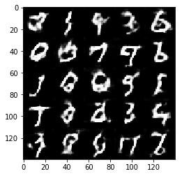


    Epoch 1/2 Step 810... Discriminator Loss: 1.2292... Generator Loss: 1.5727
    Epoch 1/2 Step 820... Discriminator Loss: 1.1716... Generator Loss: 0.9929
    Epoch 1/2 Step 830... Discriminator Loss: 1.2267... Generator Loss: 0.7066
    Epoch 1/2 Step 840... Discriminator Loss: 1.1772... Generator Loss: 0.9694
    Epoch 1/2 Step 850... Discriminator Loss: 1.1197... Generator Loss: 0.9527
    Epoch 1/2 Step 860... Discriminator Loss: 1.3595... Generator Loss: 1.6985
    Epoch 1/2 Step 870... Discriminator Loss: 1.2776... Generator Loss: 0.8640
    Epoch 1/2 Step 880... Discriminator Loss: 0.9885... Generator Loss: 1.2009
    Epoch 1/2 Step 890... Discriminator Loss: 1.1440... Generator Loss: 0.9178
    Epoch 1/2 Step 900... Discriminator Loss: 1.3139... Generator Loss: 1.1114


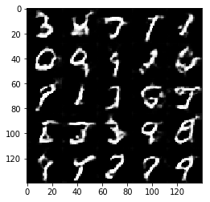


    Epoch 1/2 Step 910... Discriminator Loss: 1.1479... Generator Loss: 1.1335
    Epoch 1/2 Step 920... Discriminator Loss: 1.2107... Generator Loss: 0.8936
    Epoch 1/2 Step 930... Discriminator Loss: 1.1740... Generator Loss: 1.0676
    Epoch 2/2 Step 940... Discriminator Loss: 1.1616... Generator Loss: 0.9312
    Epoch 2/2 Step 950... Discriminator Loss: 1.3185... Generator Loss: 1.1800
    Epoch 2/2 Step 960... Discriminator Loss: 1.2804... Generator Loss: 0.8128
    Epoch 2/2 Step 970... Discriminator Loss: 1.0809... Generator Loss: 1.2207
    Epoch 2/2 Step 980... Discriminator Loss: 1.1816... Generator Loss: 1.0404
    Epoch 2/2 Step 990... Discriminator Loss: 1.2964... Generator Loss: 0.7774
    Epoch 2/2 Step 1000... Discriminator Loss: 1.1316... Generator Loss: 0.8805


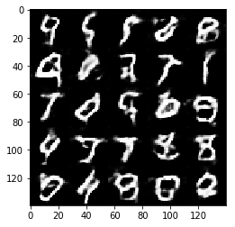


    Epoch 2/2 Step 1010... Discriminator Loss: 1.2267... Generator Loss: 0.9923
    Epoch 2/2 Step 1020... Discriminator Loss: 1.2158... Generator Loss: 1.0372
    Epoch 2/2 Step 1030... Discriminator Loss: 1.1021... Generator Loss: 0.9063
    Epoch 2/2 Step 1040... Discriminator Loss: 1.2975... Generator Loss: 0.8845
    Epoch 2/2 Step 1050... Discriminator Loss: 1.3032... Generator Loss: 0.5743
    Epoch 2/2 Step 1060... Discriminator Loss: 1.1884... Generator Loss: 0.9111
    Epoch 2/2 Step 1070... Discriminator Loss: 1.1875... Generator Loss: 0.9423
    Epoch 2/2 Step 1080... Discriminator Loss: 1.1215... Generator Loss: 1.0288
    Epoch 2/2 Step 1090... Discriminator Loss: 1.1182... Generator Loss: 0.8821
    Epoch 2/2 Step 1100... Discriminator Loss: 1.1781... Generator Loss: 0.8666


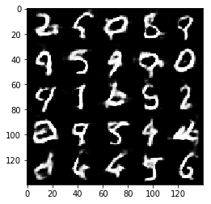


    Epoch 2/2 Step 1110... Discriminator Loss: 1.1689... Generator Loss: 0.9475
    Epoch 2/2 Step 1120... Discriminator Loss: 1.3181... Generator Loss: 1.0150
    Epoch 2/2 Step 1130... Discriminator Loss: 1.2613... Generator Loss: 0.8663
    Epoch 2/2 Step 1140... Discriminator Loss: 1.2711... Generator Loss: 0.6241
    Epoch 2/2 Step 1150... Discriminator Loss: 1.2786... Generator Loss: 0.8288
    Epoch 2/2 Step 1160... Discriminator Loss: 1.1409... Generator Loss: 1.0716
    Epoch 2/2 Step 1170... Discriminator Loss: 1.1126... Generator Loss: 1.2437
    Epoch 2/2 Step 1180... Discriminator Loss: 1.2924... Generator Loss: 1.3724
    Epoch 2/2 Step 1190... Discriminator Loss: 1.1341... Generator Loss: 0.9834
    Epoch 2/2 Step 1200... Discriminator Loss: 1.1018... Generator Loss: 1.2297


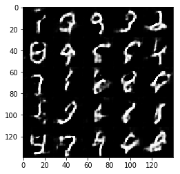


    Epoch 2/2 Step 1210... Discriminator Loss: 1.1853... Generator Loss: 1.0393
    Epoch 2/2 Step 1220... Discriminator Loss: 1.2937... Generator Loss: 0.7102
    Epoch 2/2 Step 1230... Discriminator Loss: 1.2161... Generator Loss: 1.3310
    Epoch 2/2 Step 1240... Discriminator Loss: 1.1746... Generator Loss: 0.8362
    Epoch 2/2 Step 1250... Discriminator Loss: 1.2070... Generator Loss: 1.0338
    Epoch 2/2 Step 1260... Discriminator Loss: 1.2475... Generator Loss: 1.3223
    Epoch 2/2 Step 1270... Discriminator Loss: 1.1133... Generator Loss: 0.9768
    Epoch 2/2 Step 1280... Discriminator Loss: 1.5855... Generator Loss: 1.5718
    Epoch 2/2 Step 1290... Discriminator Loss: 1.1574... Generator Loss: 0.9592
    Epoch 2/2 Step 1300... Discriminator Loss: 1.0833... Generator Loss: 1.1214


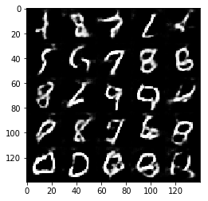


    Epoch 2/2 Step 1310... Discriminator Loss: 1.1478... Generator Loss: 1.0646
    Epoch 2/2 Step 1320... Discriminator Loss: 1.1352... Generator Loss: 1.1672
    Epoch 2/2 Step 1330... Discriminator Loss: 1.0736... Generator Loss: 1.1485
    Epoch 2/2 Step 1340... Discriminator Loss: 1.2509... Generator Loss: 1.1363
    Epoch 2/2 Step 1350... Discriminator Loss: 1.1786... Generator Loss: 0.8326
    Epoch 2/2 Step 1360... Discriminator Loss: 1.1941... Generator Loss: 0.7767
    Epoch 2/2 Step 1370... Discriminator Loss: 1.1778... Generator Loss: 0.8971
    Epoch 2/2 Step 1380... Discriminator Loss: 1.1457... Generator Loss: 1.2644
    Epoch 2/2 Step 1390... Discriminator Loss: 1.1886... Generator Loss: 1.0169
    Epoch 2/2 Step 1400... Discriminator Loss: 1.1441... Generator Loss: 1.3331


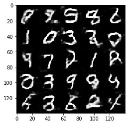


    Epoch 2/2 Step 1410... Discriminator Loss: 1.1153... Generator Loss: 1.2615
    Epoch 2/2 Step 1420... Discriminator Loss: 1.1083... Generator Loss: 1.0617
    Epoch 2/2 Step 1430... Discriminator Loss: 1.1775... Generator Loss: 1.0700
    Epoch 2/2 Step 1440... Discriminator Loss: 1.1003... Generator Loss: 0.9826
    Epoch 2/2 Step 1450... Discriminator Loss: 1.0303... Generator Loss: 0.9978
    Epoch 2/2 Step 1460... Discriminator Loss: 1.1309... Generator Loss: 0.9349
    Epoch 2/2 Step 1470... Discriminator Loss: 1.2165... Generator Loss: 0.7088
    Epoch 2/2 Step 1480... Discriminator Loss: 1.1478... Generator Loss: 1.0920
    Epoch 2/2 Step 1490... Discriminator Loss: 1.2161... Generator Loss: 0.7238
    Epoch 2/2 Step 1500... Discriminator Loss: 1.1075... Generator Loss: 0.9603


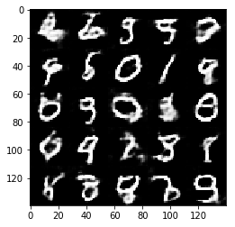


    Epoch 2/2 Step 1510... Discriminator Loss: 1.1734... Generator Loss: 1.1446
    Epoch 2/2 Step 1520... Discriminator Loss: 1.1573... Generator Loss: 1.3000
    Epoch 2/2 Step 1530... Discriminator Loss: 1.1322... Generator Loss: 1.3870
    Epoch 2/2 Step 1540... Discriminator Loss: 1.0146... Generator Loss: 0.9859
    Epoch 2/2 Step 1550... Discriminator Loss: 1.1407... Generator Loss: 0.7947
    Epoch 2/2 Step 1560... Discriminator Loss: 1.1392... Generator Loss: 0.8659
    Epoch 2/2 Step 1570... Discriminator Loss: 1.1027... Generator Loss: 1.0406
    Epoch 2/2 Step 1580... Discriminator Loss: 1.1189... Generator Loss: 1.2961
    Epoch 2/2 Step 1590... Discriminator Loss: 1.0525... Generator Loss: 1.0718
    Epoch 2/2 Step 1600... Discriminator Loss: 1.1622... Generator Loss: 1.1562


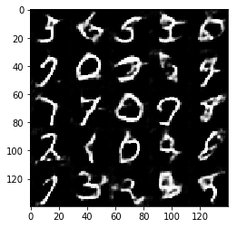


    Epoch 2/2 Step 1610... Discriminator Loss: 1.1425... Generator Loss: 1.1513
    Epoch 2/2 Step 1620... Discriminator Loss: 1.1144... Generator Loss: 1.1340
    Epoch 2/2 Step 1630... Discriminator Loss: 1.1169... Generator Loss: 1.2254
    Epoch 2/2 Step 1640... Discriminator Loss: 1.1201... Generator Loss: 1.5034
    Epoch 2/2 Step 1650... Discriminator Loss: 1.1053... Generator Loss: 1.0221
    Epoch 2/2 Step 1660... Discriminator Loss: 1.1921... Generator Loss: 1.7461
    Epoch 2/2 Step 1670... Discriminator Loss: 1.0603... Generator Loss: 0.9622
    Epoch 2/2 Step 1680... Discriminator Loss: 1.0485... Generator Loss: 1.2922
    Epoch 2/2 Step 1690... Discriminator Loss: 1.1356... Generator Loss: 0.7927
    Epoch 2/2 Step 1700... Discriminator Loss: 1.1770... Generator Loss: 1.2315


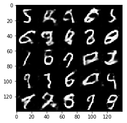


    Epoch 2/2 Step 1710... Discriminator Loss: 1.0809... Generator Loss: 1.0370
    Epoch 2/2 Step 1720... Discriminator Loss: 1.1623... Generator Loss: 1.2016
    Epoch 2/2 Step 1730... Discriminator Loss: 1.0290... Generator Loss: 1.1631
    Epoch 2/2 Step 1740... Discriminator Loss: 1.1200... Generator Loss: 0.9212
    Epoch 2/2 Step 1750... Discriminator Loss: 1.1146... Generator Loss: 1.2667
    Epoch 2/2 Step 1760... Discriminator Loss: 1.0240... Generator Loss: 1.0868
    Epoch 2/2 Step 1770... Discriminator Loss: 1.1535... Generator Loss: 0.7882
    Epoch 2/2 Step 1780... Discriminator Loss: 1.1269... Generator Loss: 0.9548
    Epoch 2/2 Step 1790... Discriminator Loss: 0.9766... Generator Loss: 1.1780
    Epoch 2/2 Step 1800... Discriminator Loss: 1.1354... Generator Loss: 1.2359


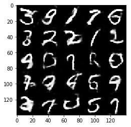


    Epoch 2/2 Step 1810... Discriminator Loss: 1.1806... Generator Loss: 1.9289
    Epoch 2/2 Step 1820... Discriminator Loss: 1.0378... Generator Loss: 1.0615
    Epoch 2/2 Step 1830... Discriminator Loss: 1.0610... Generator Loss: 1.2806
    Epoch 2/2 Step 1840... Discriminator Loss: 1.0361... Generator Loss: 1.2190
    Epoch 2/2 Step 1850... Discriminator Loss: 1.0135... Generator Loss: 1.2815
    Epoch 2/2 Step 1860... Discriminator Loss: 1.0106... Generator Loss: 0.9547
    Epoch 2/2 Step 1870... Discriminator Loss: 1.0456... Generator Loss: 1.2820


### CelebA
Run your GANs on CelebA.  It will take around 20 minutes on the average GPU to run one epoch.  You can run the whole epoch or stop when it starts to generate realistic faces.


```python
batch_size = 64
z_dim = 100
learning_rate = 0.00025
beta1 = 0.45


"""
DON'T MODIFY ANYTHING IN THIS CELL THAT IS BELOW THIS LINE
"""
epochs = 1

celeba_dataset = helper.Dataset('celeba', glob(os.path.join(data_dir, 'img_align_celeba/*.jpg')))
with tf.Graph().as_default():
    train(epochs, batch_size, z_dim, learning_rate, beta1, celeba_dataset.get_batches,
          celeba_dataset.shape, celeba_dataset.image_mode)
```

    Epoch 1/1 Step 10... Discriminator Loss: 1.1923... Generator Loss: 1.0619
    Epoch 1/1 Step 20... Discriminator Loss: 0.8847... Generator Loss: 1.5612
    Epoch 1/1 Step 30... Discriminator Loss: 0.7253... Generator Loss: 2.2552
    Epoch 1/1 Step 40... Discriminator Loss: 1.1529... Generator Loss: 0.9782
    Epoch 1/1 Step 50... Discriminator Loss: 0.9037... Generator Loss: 1.4947
    Epoch 1/1 Step 60... Discriminator Loss: 0.9751... Generator Loss: 1.3517
    Epoch 1/1 Step 70... Discriminator Loss: 0.8642... Generator Loss: 1.8543
    Epoch 1/1 Step 80... Discriminator Loss: 0.8311... Generator Loss: 2.1904
    Epoch 1/1 Step 90... Discriminator Loss: 0.6532... Generator Loss: 1.7231
    Epoch 1/1 Step 100... Discriminator Loss: 0.7097... Generator Loss: 1.9396


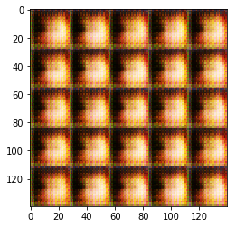


    Epoch 1/1 Step 110... Discriminator Loss: 1.2164... Generator Loss: 1.3033
    Epoch 1/1 Step 120... Discriminator Loss: 0.6557... Generator Loss: 1.7353
    Epoch 1/1 Step 130... Discriminator Loss: 0.8604... Generator Loss: 1.5573
    Epoch 1/1 Step 140... Discriminator Loss: 0.6364... Generator Loss: 1.8161
    Epoch 1/1 Step 150... Discriminator Loss: 0.6226... Generator Loss: 2.3745
    Epoch 1/1 Step 160... Discriminator Loss: 0.8441... Generator Loss: 2.1425
    Epoch 1/1 Step 170... Discriminator Loss: 0.7897... Generator Loss: 1.4632
    Epoch 1/1 Step 180... Discriminator Loss: 0.7934... Generator Loss: 1.8967
    Epoch 1/1 Step 190... Discriminator Loss: 1.0040... Generator Loss: 2.5067
    Epoch 1/1 Step 200... Discriminator Loss: 0.7859... Generator Loss: 1.3278


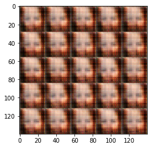


    Epoch 1/1 Step 210... Discriminator Loss: 0.9923... Generator Loss: 1.3443
    Epoch 1/1 Step 220... Discriminator Loss: 0.8302... Generator Loss: 1.4505
    Epoch 1/1 Step 230... Discriminator Loss: 1.0474... Generator Loss: 1.0436
    Epoch 1/1 Step 240... Discriminator Loss: 0.7675... Generator Loss: 1.3269
    Epoch 1/1 Step 250... Discriminator Loss: 0.8967... Generator Loss: 1.1962
    Epoch 1/1 Step 260... Discriminator Loss: 1.0902... Generator Loss: 1.4524
    Epoch 1/1 Step 270... Discriminator Loss: 1.1671... Generator Loss: 1.1588
    Epoch 1/1 Step 280... Discriminator Loss: 1.0952... Generator Loss: 0.8818
    Epoch 1/1 Step 290... Discriminator Loss: 0.9136... Generator Loss: 1.0114
    Epoch 1/1 Step 300... Discriminator Loss: 0.9857... Generator Loss: 1.4953


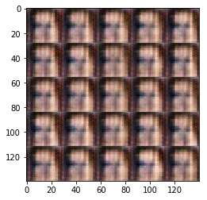


    Epoch 1/1 Step 310... Discriminator Loss: 1.3309... Generator Loss: 0.8030
    Epoch 1/1 Step 320... Discriminator Loss: 1.3973... Generator Loss: 0.6113
    Epoch 1/1 Step 330... Discriminator Loss: 0.8552... Generator Loss: 1.2200
    Epoch 1/1 Step 340... Discriminator Loss: 1.0783... Generator Loss: 1.2946
    Epoch 1/1 Step 350... Discriminator Loss: 1.4668... Generator Loss: 0.9721
    Epoch 1/1 Step 360... Discriminator Loss: 1.0025... Generator Loss: 1.1395
    Epoch 1/1 Step 370... Discriminator Loss: 0.9037... Generator Loss: 1.5921
    Epoch 1/1 Step 380... Discriminator Loss: 0.9683... Generator Loss: 1.2678
    Epoch 1/1 Step 390... Discriminator Loss: 1.2556... Generator Loss: 0.6933
    Epoch 1/1 Step 400... Discriminator Loss: 1.3400... Generator Loss: 1.0048


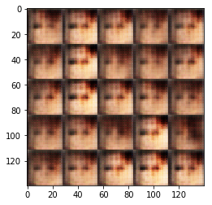


    Epoch 1/1 Step 410... Discriminator Loss: 1.0977... Generator Loss: 1.0932
    Epoch 1/1 Step 420... Discriminator Loss: 1.2130... Generator Loss: 0.9976
    Epoch 1/1 Step 430... Discriminator Loss: 1.2452... Generator Loss: 0.9409
    Epoch 1/1 Step 440... Discriminator Loss: 1.1269... Generator Loss: 1.1603
    Epoch 1/1 Step 450... Discriminator Loss: 1.1048... Generator Loss: 0.9374
    Epoch 1/1 Step 460... Discriminator Loss: 0.9352... Generator Loss: 1.2635
    Epoch 1/1 Step 470... Discriminator Loss: 1.1796... Generator Loss: 1.1176
    Epoch 1/1 Step 480... Discriminator Loss: 1.0414... Generator Loss: 1.2155
    Epoch 1/1 Step 490... Discriminator Loss: 1.1164... Generator Loss: 1.2350
    Epoch 1/1 Step 500... Discriminator Loss: 1.0497... Generator Loss: 1.2831


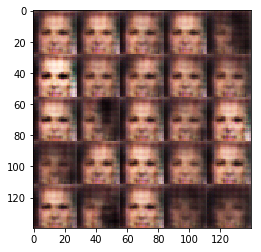


    Epoch 1/1 Step 510... Discriminator Loss: 0.9436... Generator Loss: 1.3195
    Epoch 1/1 Step 520... Discriminator Loss: 1.0598... Generator Loss: 1.3665
    Epoch 1/1 Step 530... Discriminator Loss: 1.1168... Generator Loss: 1.4097
    Epoch 1/1 Step 540... Discriminator Loss: 1.3316... Generator Loss: 1.3381
    Epoch 1/1 Step 550... Discriminator Loss: 1.0232... Generator Loss: 1.1463
    Epoch 1/1 Step 560... Discriminator Loss: 0.9716... Generator Loss: 1.2827
    Epoch 1/1 Step 570... Discriminator Loss: 1.1476... Generator Loss: 1.0632
    Epoch 1/1 Step 580... Discriminator Loss: 1.1149... Generator Loss: 1.0924
    Epoch 1/1 Step 590... Discriminator Loss: 0.9377... Generator Loss: 1.2549
    Epoch 1/1 Step 600... Discriminator Loss: 0.8410... Generator Loss: 1.3579


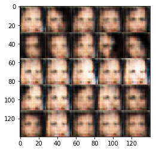


    Epoch 1/1 Step 610... Discriminator Loss: 0.9827... Generator Loss: 1.2260
    Epoch 1/1 Step 620... Discriminator Loss: 1.1978... Generator Loss: 0.9127
    Epoch 1/1 Step 630... Discriminator Loss: 0.8438... Generator Loss: 1.4349
    Epoch 1/1 Step 640... Discriminator Loss: 0.9228... Generator Loss: 1.2276
    Epoch 1/1 Step 650... Discriminator Loss: 1.0957... Generator Loss: 0.9674
    Epoch 1/1 Step 660... Discriminator Loss: 1.3715... Generator Loss: 0.8749
    Epoch 1/1 Step 670... Discriminator Loss: 1.1011... Generator Loss: 1.0899
    Epoch 1/1 Step 680... Discriminator Loss: 1.4351... Generator Loss: 1.7697
    Epoch 1/1 Step 690... Discriminator Loss: 1.1669... Generator Loss: 1.1191
    Epoch 1/1 Step 700... Discriminator Loss: 1.1407... Generator Loss: 0.9626


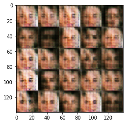


    Epoch 1/1 Step 710... Discriminator Loss: 1.1297... Generator Loss: 0.9919
    Epoch 1/1 Step 720... Discriminator Loss: 0.8562... Generator Loss: 1.4441
    Epoch 1/1 Step 730... Discriminator Loss: 1.2255... Generator Loss: 0.8633
    Epoch 1/1 Step 740... Discriminator Loss: 1.0140... Generator Loss: 1.0785
    Epoch 1/1 Step 750... Discriminator Loss: 1.1385... Generator Loss: 1.0930
    Epoch 1/1 Step 760... Discriminator Loss: 1.0479... Generator Loss: 1.2119
    Epoch 1/1 Step 770... Discriminator Loss: 1.2810... Generator Loss: 0.8114
    Epoch 1/1 Step 780... Discriminator Loss: 1.3999... Generator Loss: 0.8081
    Epoch 1/1 Step 790... Discriminator Loss: 0.9954... Generator Loss: 1.0913
    Epoch 1/1 Step 800... Discriminator Loss: 1.0328... Generator Loss: 1.1236


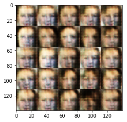


    Epoch 1/1 Step 810... Discriminator Loss: 1.4631... Generator Loss: 0.9160
    Epoch 1/1 Step 820... Discriminator Loss: 1.2105... Generator Loss: 0.9525
    Epoch 1/1 Step 830... Discriminator Loss: 1.0939... Generator Loss: 1.0626
    Epoch 1/1 Step 840... Discriminator Loss: 1.1941... Generator Loss: 0.9731
    Epoch 1/1 Step 850... Discriminator Loss: 1.2540... Generator Loss: 0.9629
    Epoch 1/1 Step 860... Discriminator Loss: 1.2205... Generator Loss: 0.9789
    Epoch 1/1 Step 870... Discriminator Loss: 1.3687... Generator Loss: 0.8293
    Epoch 1/1 Step 880... Discriminator Loss: 1.4081... Generator Loss: 0.6119
    Epoch 1/1 Step 890... Discriminator Loss: 1.2686... Generator Loss: 0.9554
    Epoch 1/1 Step 900... Discriminator Loss: 1.2074... Generator Loss: 0.9831


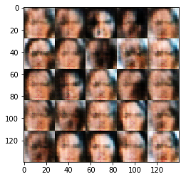


    Epoch 1/1 Step 910... Discriminator Loss: 1.2182... Generator Loss: 0.9753
    Epoch 1/1 Step 920... Discriminator Loss: 1.2466... Generator Loss: 0.9139
    Epoch 1/1 Step 930... Discriminator Loss: 1.4349... Generator Loss: 0.8201
    Epoch 1/1 Step 940... Discriminator Loss: 1.1531... Generator Loss: 0.9302
    Epoch 1/1 Step 950... Discriminator Loss: 1.1979... Generator Loss: 0.9504
    Epoch 1/1 Step 960... Discriminator Loss: 1.2089... Generator Loss: 0.9400
    Epoch 1/1 Step 970... Discriminator Loss: 1.2736... Generator Loss: 0.9079
    Epoch 1/1 Step 980... Discriminator Loss: 1.2024... Generator Loss: 0.9266
    Epoch 1/1 Step 990... Discriminator Loss: 1.2679... Generator Loss: 0.9277
    Epoch 1/1 Step 1000... Discriminator Loss: 1.5124... Generator Loss: 0.6716


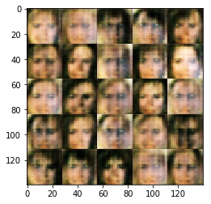


    Epoch 1/1 Step 1010... Discriminator Loss: 1.3388... Generator Loss: 0.8402
    Epoch 1/1 Step 1020... Discriminator Loss: 1.2933... Generator Loss: 0.8638
    Epoch 1/1 Step 1030... Discriminator Loss: 1.3404... Generator Loss: 0.8900
    Epoch 1/1 Step 1040... Discriminator Loss: 1.2643... Generator Loss: 0.9928
    Epoch 1/1 Step 1050... Discriminator Loss: 1.0944... Generator Loss: 1.0511
    Epoch 1/1 Step 1060... Discriminator Loss: 1.2442... Generator Loss: 0.9050
    Epoch 1/1 Step 1070... Discriminator Loss: 1.4615... Generator Loss: 0.6161
    Epoch 1/1 Step 1080... Discriminator Loss: 1.3600... Generator Loss: 0.8153
    Epoch 1/1 Step 1090... Discriminator Loss: 1.2889... Generator Loss: 0.8568
    Epoch 1/1 Step 1100... Discriminator Loss: 1.2965... Generator Loss: 0.8975


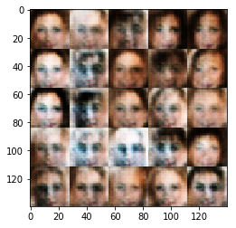


    Epoch 1/1 Step 1110... Discriminator Loss: 1.2403... Generator Loss: 0.9175
    Epoch 1/1 Step 1120... Discriminator Loss: 1.1919... Generator Loss: 0.9891
    Epoch 1/1 Step 1130... Discriminator Loss: 1.2344... Generator Loss: 0.9184
    Epoch 1/1 Step 1140... Discriminator Loss: 1.1877... Generator Loss: 0.9095
    Epoch 1/1 Step 1150... Discriminator Loss: 1.3223... Generator Loss: 0.8793
    Epoch 1/1 Step 1160... Discriminator Loss: 1.2144... Generator Loss: 0.9659
    Epoch 1/1 Step 1170... Discriminator Loss: 1.2813... Generator Loss: 0.8865
    Epoch 1/1 Step 1180... Discriminator Loss: 1.3492... Generator Loss: 0.8701
    Epoch 1/1 Step 1190... Discriminator Loss: 1.2831... Generator Loss: 0.8515
    Epoch 1/1 Step 1200... Discriminator Loss: 1.3274... Generator Loss: 0.9188


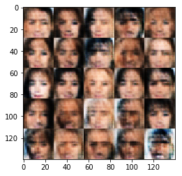


    Epoch 1/1 Step 1210... Discriminator Loss: 1.2326... Generator Loss: 0.8728
    Epoch 1/1 Step 1220... Discriminator Loss: 1.3130... Generator Loss: 0.8501
    Epoch 1/1 Step 1230... Discriminator Loss: 1.2268... Generator Loss: 0.9261
    Epoch 1/1 Step 1240... Discriminator Loss: 1.3196... Generator Loss: 0.8490
    Epoch 1/1 Step 1250... Discriminator Loss: 1.3112... Generator Loss: 0.9161
    Epoch 1/1 Step 1260... Discriminator Loss: 1.3162... Generator Loss: 0.8013
    Epoch 1/1 Step 1270... Discriminator Loss: 1.2692... Generator Loss: 0.8660
    Epoch 1/1 Step 1280... Discriminator Loss: 1.3600... Generator Loss: 0.7705
    Epoch 1/1 Step 1290... Discriminator Loss: 1.2182... Generator Loss: 0.9913
    Epoch 1/1 Step 1300... Discriminator Loss: 1.3615... Generator Loss: 0.8459


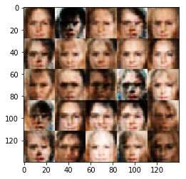


    Epoch 1/1 Step 1310... Discriminator Loss: 1.2586... Generator Loss: 0.9633
    Epoch 1/1 Step 1320... Discriminator Loss: 1.4514... Generator Loss: 0.7909
    Epoch 1/1 Step 1330... Discriminator Loss: 1.2384... Generator Loss: 0.9520
    Epoch 1/1 Step 1340... Discriminator Loss: 1.3261... Generator Loss: 0.8321
    Epoch 1/1 Step 1350... Discriminator Loss: 1.2829... Generator Loss: 0.8734
    Epoch 1/1 Step 1360... Discriminator Loss: 1.3722... Generator Loss: 0.7664
    Epoch 1/1 Step 1370... Discriminator Loss: 1.2595... Generator Loss: 0.9310
    Epoch 1/1 Step 1380... Discriminator Loss: 1.4562... Generator Loss: 0.8227
    Epoch 1/1 Step 1390... Discriminator Loss: 1.3693... Generator Loss: 0.8304
    Epoch 1/1 Step 1400... Discriminator Loss: 1.3323... Generator Loss: 0.7942


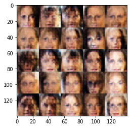


    Epoch 1/1 Step 1410... Discriminator Loss: 1.3392... Generator Loss: 0.7723
    Epoch 1/1 Step 1420... Discriminator Loss: 1.3532... Generator Loss: 0.9296
    Epoch 1/1 Step 1430... Discriminator Loss: 1.1952... Generator Loss: 0.9473
    Epoch 1/1 Step 1440... Discriminator Loss: 1.3332... Generator Loss: 0.8431
    Epoch 1/1 Step 1450... Discriminator Loss: 1.2542... Generator Loss: 0.9724
    Epoch 1/1 Step 1460... Discriminator Loss: 1.2555... Generator Loss: 0.9741
    Epoch 1/1 Step 1470... Discriminator Loss: 1.2394... Generator Loss: 0.8524
    Epoch 1/1 Step 1480... Discriminator Loss: 1.2315... Generator Loss: 0.8489
    Epoch 1/1 Step 1490... Discriminator Loss: 1.2507... Generator Loss: 0.8976
    Epoch 1/1 Step 1500... Discriminator Loss: 1.2816... Generator Loss: 0.8757


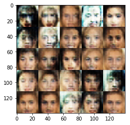


    Epoch 1/1 Step 1510... Discriminator Loss: 1.2103... Generator Loss: 0.9402
    Epoch 1/1 Step 1520... Discriminator Loss: 1.1831... Generator Loss: 0.9088
    Epoch 1/1 Step 1530... Discriminator Loss: 1.3482... Generator Loss: 0.8542
    Epoch 1/1 Step 1540... Discriminator Loss: 1.2152... Generator Loss: 0.8460
    Epoch 1/1 Step 1550... Discriminator Loss: 1.3203... Generator Loss: 0.8929
    Epoch 1/1 Step 1560... Discriminator Loss: 1.2590... Generator Loss: 0.8525
    Epoch 1/1 Step 1570... Discriminator Loss: 1.1914... Generator Loss: 0.9716
    Epoch 1/1 Step 1580... Discriminator Loss: 1.2383... Generator Loss: 0.9613
    Epoch 1/1 Step 1590... Discriminator Loss: 1.3581... Generator Loss: 0.8118
    Epoch 1/1 Step 1600... Discriminator Loss: 1.2230... Generator Loss: 1.0151


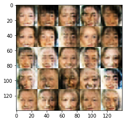


    Epoch 1/1 Step 1610... Discriminator Loss: 1.2895... Generator Loss: 0.9529
    Epoch 1/1 Step 1620... Discriminator Loss: 1.2692... Generator Loss: 0.9522
    Epoch 1/1 Step 1630... Discriminator Loss: 1.3056... Generator Loss: 0.9498
    Epoch 1/1 Step 1640... Discriminator Loss: 1.3241... Generator Loss: 0.8124
    Epoch 1/1 Step 1650... Discriminator Loss: 1.3169... Generator Loss: 0.8940
    Epoch 1/1 Step 1660... Discriminator Loss: 1.1827... Generator Loss: 0.8359
    Epoch 1/1 Step 1670... Discriminator Loss: 1.3125... Generator Loss: 0.9830
    Epoch 1/1 Step 1680... Discriminator Loss: 1.2833... Generator Loss: 0.8886
    Epoch 1/1 Step 1690... Discriminator Loss: 1.1912... Generator Loss: 0.9081
    Epoch 1/1 Step 1700... Discriminator Loss: 1.4000... Generator Loss: 0.9463


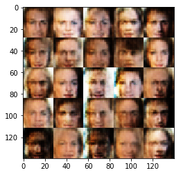


    Epoch 1/1 Step 1710... Discriminator Loss: 1.3651... Generator Loss: 0.9171
    Epoch 1/1 Step 1720... Discriminator Loss: 1.3685... Generator Loss: 0.9819
    Epoch 1/1 Step 1730... Discriminator Loss: 1.2335... Generator Loss: 0.8187
    Epoch 1/1 Step 1740... Discriminator Loss: 1.3015... Generator Loss: 1.1337
    Epoch 1/1 Step 1750... Discriminator Loss: 1.1935... Generator Loss: 0.8961
    Epoch 1/1 Step 1760... Discriminator Loss: 1.2949... Generator Loss: 0.9315
    Epoch 1/1 Step 1770... Discriminator Loss: 1.2660... Generator Loss: 1.0003
    Epoch 1/1 Step 1780... Discriminator Loss: 1.3147... Generator Loss: 0.8671
    Epoch 1/1 Step 1790... Discriminator Loss: 1.2237... Generator Loss: 0.8751
    Epoch 1/1 Step 1800... Discriminator Loss: 1.2628... Generator Loss: 0.8613


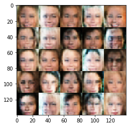


    Epoch 1/1 Step 1810... Discriminator Loss: 1.3338... Generator Loss: 0.8995
    Epoch 1/1 Step 1820... Discriminator Loss: 1.2583... Generator Loss: 0.9592
    Epoch 1/1 Step 1830... Discriminator Loss: 1.1613... Generator Loss: 0.9815
    Epoch 1/1 Step 1840... Discriminator Loss: 1.3104... Generator Loss: 0.8879
    Epoch 1/1 Step 1850... Discriminator Loss: 1.2239... Generator Loss: 0.9465
    Epoch 1/1 Step 1860... Discriminator Loss: 1.3447... Generator Loss: 0.9199
    Epoch 1/1 Step 1870... Discriminator Loss: 1.2658... Generator Loss: 0.8833
    Epoch 1/1 Step 1880... Discriminator Loss: 1.3205... Generator Loss: 0.8936
    Epoch 1/1 Step 1890... Discriminator Loss: 1.2395... Generator Loss: 0.8944
    Epoch 1/1 Step 1900... Discriminator Loss: 1.3185... Generator Loss: 0.8002


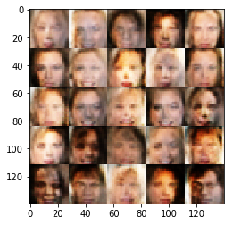


    Epoch 1/1 Step 1910... Discriminator Loss: 1.1806... Generator Loss: 0.8772
    Epoch 1/1 Step 1920... Discriminator Loss: 1.2622... Generator Loss: 0.9697
    Epoch 1/1 Step 1930... Discriminator Loss: 1.3722... Generator Loss: 0.8770
    Epoch 1/1 Step 1940... Discriminator Loss: 1.2872... Generator Loss: 0.8463
    Epoch 1/1 Step 1950... Discriminator Loss: 1.3369... Generator Loss: 0.8414
    Epoch 1/1 Step 1960... Discriminator Loss: 1.3121... Generator Loss: 0.9786
    Epoch 1/1 Step 1970... Discriminator Loss: 1.3131... Generator Loss: 0.9226
    Epoch 1/1 Step 1980... Discriminator Loss: 1.1927... Generator Loss: 0.9848
    Epoch 1/1 Step 1990... Discriminator Loss: 1.3156... Generator Loss: 0.8322
    Epoch 1/1 Step 2000... Discriminator Loss: 1.2278... Generator Loss: 0.9830


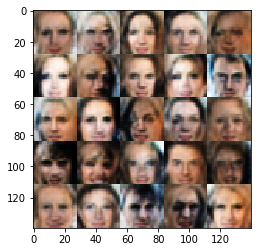


    Epoch 1/1 Step 2010... Discriminator Loss: 1.3110... Generator Loss: 0.9718
    Epoch 1/1 Step 2020... Discriminator Loss: 1.1931... Generator Loss: 0.9451
    Epoch 1/1 Step 2030... Discriminator Loss: 1.3129... Generator Loss: 0.8597
    Epoch 1/1 Step 2040... Discriminator Loss: 1.2311... Generator Loss: 0.8633
    Epoch 1/1 Step 2050... Discriminator Loss: 1.1834... Generator Loss: 0.9799
    Epoch 1/1 Step 2060... Discriminator Loss: 1.3249... Generator Loss: 0.8558
    Epoch 1/1 Step 2070... Discriminator Loss: 1.3594... Generator Loss: 0.8531
    Epoch 1/1 Step 2080... Discriminator Loss: 1.3421... Generator Loss: 0.9192
    Epoch 1/1 Step 2090... Discriminator Loss: 1.3145... Generator Loss: 0.8786
    Epoch 1/1 Step 2100... Discriminator Loss: 1.3520... Generator Loss: 0.8524


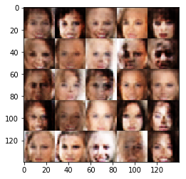


    Epoch 1/1 Step 2110... Discriminator Loss: 1.3072... Generator Loss: 0.8514
    Epoch 1/1 Step 2120... Discriminator Loss: 1.3000... Generator Loss: 0.9255
    Epoch 1/1 Step 2130... Discriminator Loss: 1.3056... Generator Loss: 0.8748
    Epoch 1/1 Step 2140... Discriminator Loss: 1.2887... Generator Loss: 0.9470
    Epoch 1/1 Step 2150... Discriminator Loss: 1.2169... Generator Loss: 1.0020
    Epoch 1/1 Step 2160... Discriminator Loss: 1.1951... Generator Loss: 0.9182
    Epoch 1/1 Step 2170... Discriminator Loss: 1.2333... Generator Loss: 1.0957
    Epoch 1/1 Step 2180... Discriminator Loss: 1.2141... Generator Loss: 0.8232
    Epoch 1/1 Step 2190... Discriminator Loss: 1.3080... Generator Loss: 1.0119
    Epoch 1/1 Step 2200... Discriminator Loss: 1.2547... Generator Loss: 0.9168


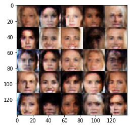


    Epoch 1/1 Step 2210... Discriminator Loss: 1.2376... Generator Loss: 0.8688
    Epoch 1/1 Step 2220... Discriminator Loss: 1.2269... Generator Loss: 1.0456
    Epoch 1/1 Step 2230... Discriminator Loss: 1.2745... Generator Loss: 0.8568
    Epoch 1/1 Step 2240... Discriminator Loss: 1.1823... Generator Loss: 1.0829
    Epoch 1/1 Step 2250... Discriminator Loss: 1.1820... Generator Loss: 1.0464
    Epoch 1/1 Step 2260... Discriminator Loss: 1.3379... Generator Loss: 0.8111
    Epoch 1/1 Step 2270... Discriminator Loss: 1.2437... Generator Loss: 0.8382
    Epoch 1/1 Step 2280... Discriminator Loss: 1.2876... Generator Loss: 0.8606
    Epoch 1/1 Step 2290... Discriminator Loss: 1.3566... Generator Loss: 0.8598
    Epoch 1/1 Step 2300... Discriminator Loss: 1.2450... Generator Loss: 0.8517


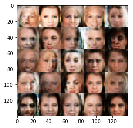


    Epoch 1/1 Step 2310... Discriminator Loss: 1.3203... Generator Loss: 0.9015
    Epoch 1/1 Step 2320... Discriminator Loss: 1.2204... Generator Loss: 0.9309
    Epoch 1/1 Step 2330... Discriminator Loss: 1.3061... Generator Loss: 0.8788
    Epoch 1/1 Step 2340... Discriminator Loss: 1.2441... Generator Loss: 0.8183
    Epoch 1/1 Step 2350... Discriminator Loss: 1.1913... Generator Loss: 1.1924
    Epoch 1/1 Step 2360... Discriminator Loss: 1.2642... Generator Loss: 0.8533
    Epoch 1/1 Step 2370... Discriminator Loss: 1.2420... Generator Loss: 0.8720
    Epoch 1/1 Step 2380... Discriminator Loss: 1.2320... Generator Loss: 0.8442
    Epoch 1/1 Step 2390... Discriminator Loss: 1.3482... Generator Loss: 0.7842
    Epoch 1/1 Step 2400... Discriminator Loss: 1.2322... Generator Loss: 0.7789


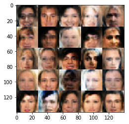


    Epoch 1/1 Step 2410... Discriminator Loss: 1.3463... Generator Loss: 1.1030
    Epoch 1/1 Step 2420... Discriminator Loss: 1.3113... Generator Loss: 0.8864
    Epoch 1/1 Step 2430... Discriminator Loss: 1.3211... Generator Loss: 0.8143
    Epoch 1/1 Step 2440... Discriminator Loss: 1.2209... Generator Loss: 0.8687
    Epoch 1/1 Step 2450... Discriminator Loss: 1.2589... Generator Loss: 0.8560
    Epoch 1/1 Step 2460... Discriminator Loss: 1.2340... Generator Loss: 0.9571
    Epoch 1/1 Step 2470... Discriminator Loss: 1.2265... Generator Loss: 0.9154
    Epoch 1/1 Step 2480... Discriminator Loss: 1.2878... Generator Loss: 1.0082
    Epoch 1/1 Step 2490... Discriminator Loss: 1.3153... Generator Loss: 0.8937
    Epoch 1/1 Step 2500... Discriminator Loss: 1.2765... Generator Loss: 0.8070


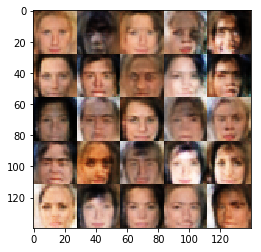


    Epoch 1/1 Step 2510... Discriminator Loss: 1.2976... Generator Loss: 0.7901
    Epoch 1/1 Step 2520... Discriminator Loss: 1.3145... Generator Loss: 0.9627
    Epoch 1/1 Step 2530... Discriminator Loss: 1.2367... Generator Loss: 0.8962
    Epoch 1/1 Step 2540... Discriminator Loss: 1.3234... Generator Loss: 0.7225
    Epoch 1/1 Step 2550... Discriminator Loss: 1.2035... Generator Loss: 0.8189
    Epoch 1/1 Step 2560... Discriminator Loss: 1.1539... Generator Loss: 0.9806
    Epoch 1/1 Step 2570... Discriminator Loss: 1.1924... Generator Loss: 0.9337
    Epoch 1/1 Step 2580... Discriminator Loss: 1.1695... Generator Loss: 0.9207
    Epoch 1/1 Step 2590... Discriminator Loss: 1.1744... Generator Loss: 0.9908
    Epoch 1/1 Step 2600... Discriminator Loss: 1.3099... Generator Loss: 0.8277


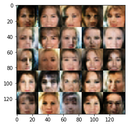


    Epoch 1/1 Step 2610... Discriminator Loss: 1.2606... Generator Loss: 0.8895
    Epoch 1/1 Step 2620... Discriminator Loss: 1.2807... Generator Loss: 0.9089
    Epoch 1/1 Step 2630... Discriminator Loss: 1.3345... Generator Loss: 0.9334
    Epoch 1/1 Step 2640... Discriminator Loss: 1.2186... Generator Loss: 0.8774
    Epoch 1/1 Step 2650... Discriminator Loss: 1.2342... Generator Loss: 0.9948
    Epoch 1/1 Step 2660... Discriminator Loss: 1.1997... Generator Loss: 0.9304
    Epoch 1/1 Step 2670... Discriminator Loss: 1.2240... Generator Loss: 0.8607
    Epoch 1/1 Step 2680... Discriminator Loss: 1.1935... Generator Loss: 1.0248
    Epoch 1/1 Step 2690... Discriminator Loss: 1.2394... Generator Loss: 0.9873
    Epoch 1/1 Step 2700... Discriminator Loss: 1.2524... Generator Loss: 0.7501


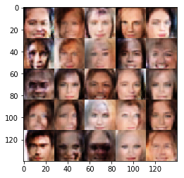


    Epoch 1/1 Step 2710... Discriminator Loss: 1.2457... Generator Loss: 0.9330
    Epoch 1/1 Step 2720... Discriminator Loss: 1.2474... Generator Loss: 0.8811
    Epoch 1/1 Step 2730... Discriminator Loss: 1.2288... Generator Loss: 0.9797
    Epoch 1/1 Step 2740... Discriminator Loss: 1.2391... Generator Loss: 0.8512
    Epoch 1/1 Step 2750... Discriminator Loss: 1.2185... Generator Loss: 0.9046
    Epoch 1/1 Step 2760... Discriminator Loss: 1.3194... Generator Loss: 1.1482
    Epoch 1/1 Step 2770... Discriminator Loss: 1.2647... Generator Loss: 0.8475
    Epoch 1/1 Step 2780... Discriminator Loss: 1.3253... Generator Loss: 1.0081
    Epoch 1/1 Step 2790... Discriminator Loss: 1.3284... Generator Loss: 0.9731
    Epoch 1/1 Step 2800... Discriminator Loss: 1.3027... Generator Loss: 1.0066


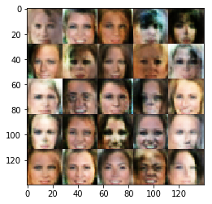


    Epoch 1/1 Step 2810... Discriminator Loss: 1.2378... Generator Loss: 0.8529
    Epoch 1/1 Step 2820... Discriminator Loss: 1.2738... Generator Loss: 1.1321
    Epoch 1/1 Step 2830... Discriminator Loss: 1.1903... Generator Loss: 1.0802
    Epoch 1/1 Step 2840... Discriminator Loss: 1.2337... Generator Loss: 0.8742
    Epoch 1/1 Step 2850... Discriminator Loss: 1.3445... Generator Loss: 0.7539
    Epoch 1/1 Step 2860... Discriminator Loss: 1.2548... Generator Loss: 0.9122
    Epoch 1/1 Step 2870... Discriminator Loss: 1.2611... Generator Loss: 0.8623
    Epoch 1/1 Step 2880... Discriminator Loss: 1.3138... Generator Loss: 0.7388
    Epoch 1/1 Step 2890... Discriminator Loss: 1.2270... Generator Loss: 0.7878
    Epoch 1/1 Step 2900... Discriminator Loss: 1.2875... Generator Loss: 0.9383


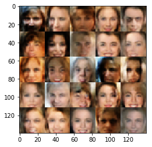


    Epoch 1/1 Step 2910... Discriminator Loss: 1.1776... Generator Loss: 0.8973
    Epoch 1/1 Step 2920... Discriminator Loss: 1.2267... Generator Loss: 0.8615
    Epoch 1/1 Step 2930... Discriminator Loss: 1.2709... Generator Loss: 1.0457
    Epoch 1/1 Step 2940... Discriminator Loss: 1.1884... Generator Loss: 1.0472
    Epoch 1/1 Step 2950... Discriminator Loss: 1.2368... Generator Loss: 1.1889
    Epoch 1/1 Step 2960... Discriminator Loss: 1.2937... Generator Loss: 0.8199
    Epoch 1/1 Step 2970... Discriminator Loss: 1.2720... Generator Loss: 1.0777
    Epoch 1/1 Step 2980... Discriminator Loss: 1.2937... Generator Loss: 0.8844
    Epoch 1/1 Step 2990... Discriminator Loss: 1.2471... Generator Loss: 0.8309
    Epoch 1/1 Step 3000... Discriminator Loss: 1.1893... Generator Loss: 0.8754


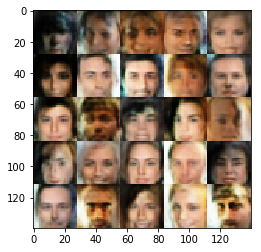


    Epoch 1/1 Step 3010... Discriminator Loss: 1.2976... Generator Loss: 1.1603
    Epoch 1/1 Step 3020... Discriminator Loss: 1.2290... Generator Loss: 0.8298
    Epoch 1/1 Step 3030... Discriminator Loss: 1.2700... Generator Loss: 0.9263
    Epoch 1/1 Step 3040... Discriminator Loss: 1.2020... Generator Loss: 0.9727
    Epoch 1/1 Step 3050... Discriminator Loss: 1.1775... Generator Loss: 0.9641
    Epoch 1/1 Step 3060... Discriminator Loss: 1.2869... Generator Loss: 0.8641
    Epoch 1/1 Step 3070... Discriminator Loss: 1.2373... Generator Loss: 0.8443
    Epoch 1/1 Step 3080... Discriminator Loss: 1.2704... Generator Loss: 0.9682
    Epoch 1/1 Step 3090... Discriminator Loss: 1.2054... Generator Loss: 1.0179
    Epoch 1/1 Step 3100... Discriminator Loss: 1.2684... Generator Loss: 0.9440


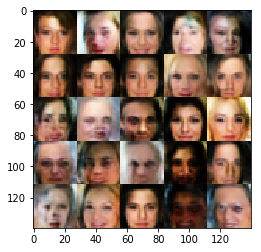


    Epoch 1/1 Step 3110... Discriminator Loss: 1.2617... Generator Loss: 0.7455
    Epoch 1/1 Step 3120... Discriminator Loss: 1.3192... Generator Loss: 0.7933
    Epoch 1/1 Step 3130... Discriminator Loss: 1.2352... Generator Loss: 0.8439
    Epoch 1/1 Step 3140... Discriminator Loss: 1.2679... Generator Loss: 0.9206
    Epoch 1/1 Step 3150... Discriminator Loss: 1.2087... Generator Loss: 0.9003
    Epoch 1/1 Step 3160... Discriminator Loss: 1.2562... Generator Loss: 0.8847


```python

```
